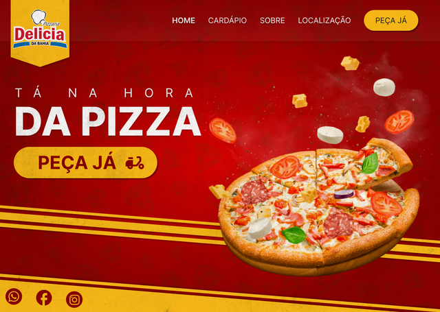

### <div align="center">Pizzaria Delicia da Bahia</div>

<p align="center">
  
</p>

<div align="center">
    <a target="_blank" href="https://www.pizzariadeliciadabahia.com/">
        
    </a>
    <a target="_blank" href="https://www.figma.com/file/NvP58fWAUspNTvx5mLnoPC/Site---Pizzaria-Delicia-da-Bahia?node-id=11%3A25&t=88RvIRhdUBlI4v9O-1">
        
    </a>
</div>
<div align="center">
     <a>
        
    </a>
     <a>
        
    </a>
    <a>
        
    </a>
    <a>
        
    </a>
    <a href="https://github.com/anthonyvictor/pizzariadeliciadabahia">
        
    </a>
    <a href="https://github.com/anthonyvictor/pizzariadeliciadabahia/issues">
        
    </a>
    <a href="https://github.com/anthonyvictor/pizzariadeliciadabahia/pulls">
        
    </a>
</div>

---

#### 🍕 Introdução
Webapp da **Pizzaria Delicia da Bahia**, pensado inicialmente para servir apenas como um cardápio estático, e para apresentar informações sobre o estabelecimento, posteriormente se tornou uma **plataforma robusta de pedidos.** Hoje o app conta com **cadastros de clientes**, produtos, endereços, combos e promoções, além de controle de estoque, **autocomplete de endereços** com apis externas, **pix online**, e fácil integração com outros apps.   

---

#### 🚀 Tecnologias Utilizadas
`Next.js`, `Typescript`, `Styled-components`, `MongoDB`    

---

#### ⏳ Instalação e uso
Siga os passos abaixo para rodar o projeto localmente:

```bash
# Clone este repositório
git clone https://github.com/anthonyvictor/pizzariadeliciadabahia.git

# Adicione as variáveis de ambiente
NEXT_PUBLIC_API_URL # url do backend
NEXT_PUBLIC_WHATSAPP # whatsapp para contato
CEPABERTO_TOKEN #token para autocomplete de endereços do cepaberto
ORS_API_KEY # chave de api do openrouteservice para obter distâncias
DATABASE_URL # url do banco mongodb
EMAIL_LOJA # login para acessar configurações
SENHA_LOJA # senha para acessar configurações

# Acesse a pasta do projeto
cd pizzariadeliciadabahia

# Instale as dependências
yarn

# Inicie o servidor de desenvolvimento
yarn dev
```

---

#### ⬆️ Rotas

`Static`
```
├─/home
|─/cardapio (Com revalidação)
├─/localizacao
└─/sobre
```

`Single Page`
```
├─/pedido
| ├───/lanche
| ├───/pizza
| |   ├───/tamanho
| |   └───/sabores
| ├───/bebida
| ├───/itens
| ├───/informacoes-adicionais
| ├───/pagamento
| └───/confirmacao
└─────────────────
```


#next.js #styled-components #react.js